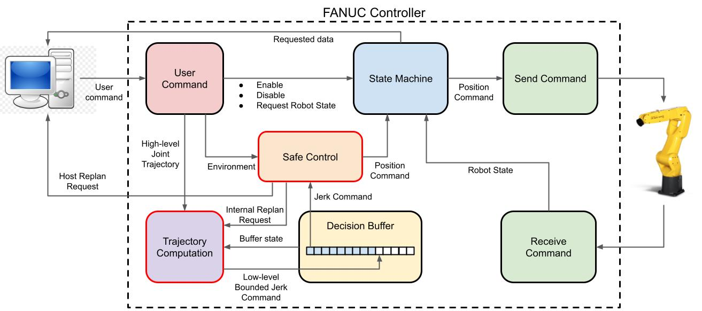
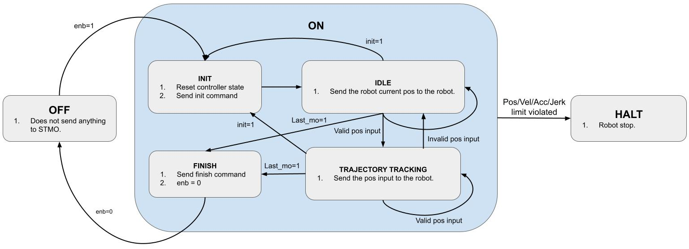

# Real-time Jerk-bounded Position Controller

This repo contains the real-time jerk-bounded position controller for industrial robots, e.g. the FANUC LR-mate 200id 7L.

Functions included:
* Joint trajectory tracking.
* Real-time online joint trajectory modification.
* Jerk-based Safe Set Algorithm (JSSA).

Hardwares: FANUC LR-mate 200id 7L robot, Speedgoat.

Question contact: ruixuanl@andrew.cmu.edu.

## Operation Guide
The current implementation was tested on the FANUC LR-mate 200id 7L robot.

1. Compile the Simulink model of the controller. In the MATLAB terminal, run `make exp`.
2. Turn on the Speedgoat by pressing the power button.
3. Turn on the FANUC robot by turning the switch 90 degree clockwise.
4. On the teaching pendant, press `Shift`+`Reset`.
5. On the teaching pendant, press `FCTN`->`Abort All`.
6. On the teaching pendant, select the Stream Motion program.
7. On the robot controll box, press the green button.
8. Run `Fanuc_controller_test.m`.

## Controller Design

### Controller Diagram

The controller is implemented using MATLAB Simulink Real-Time. 
The controller has a parallel design, which is shown in the diagram and each block represents a module.
The modules with black border run at 1kHz and the modules with red border run at 125Hz.

* `User Command`: The user command module, shown in pink, is the communication interface between the controller and the host computer. It receives and parses the high-level command by the user.
* `Send/Receive Command`: The send/receive command modules, shown in green, are the communication interface between the controller and the robot. They run at 1kHz to maintain the stable communication and keep the robot alive.
* `Trajectory Computation`: The trajectory computation module, shown in purple, computes a bounded jerk control profile from the high-level joint trajectory specified by the user.
* `Decision Buffer`: The decision buffer module, shown in yellow, organizes the generated command sequence and decides which to send to the robot.
* `State Machine`: The state machine module, shown in blue, tracks the controller and robot states and sends the feedback to the host computer and appropriate position command to the robot accordingly.
* `Safe Control`: The safe control module, shown in orange, implements JSSA and guards the nominal control output. It modifies the nominal control if needed. The input is the nominal jerk command and the output is the safe position command.

### State Machine Diagram 

### Trajectory Computation
See [trajectory computation](https://drive.google.com/file/d/1cCfQcyXHuPSSkdjDL4oviiMjiLxOBj-5/view?usp=sharing) for the detail.

### Trajectory Modification Mechanism
See [online trajectory modification strategy](https://docs.google.com/presentation/d/1FJ9bxuhrR9TpgFnQ6SVKff9BUiEN4-DrA1mfjJ-wFig/edit?usp=sharing) for the detail.
